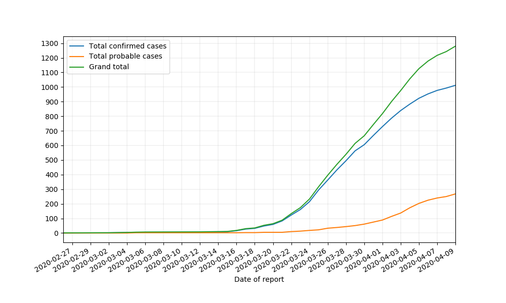

# COVID-19 NZ Data Processing

Script to automatically fetch, process, and plot the NZ covid-19 data from the Ministry of Health's website (https://health.govt.nz).

Getting started:
- 
Dependencies:
- pandas
- requests
- xlrd
- beautifulsoup4
- matplotlib

Simply clone the repo:

`git clone https://github.com/mahyar-osn/moh-data.git`

Then:

`cd moh-data`

Run:

`pip install -e .`

Example of usage:

```python
from moh_data.main import Basic

run_data = Basic()
run_data.plot_daily_trend()
run_data.plot_cumulative_sum()
run_data.plot_daily_arrival_sum()
run_data.plot_overseas_date_reported()
```

Running the above code in a file should produce the following figures:





